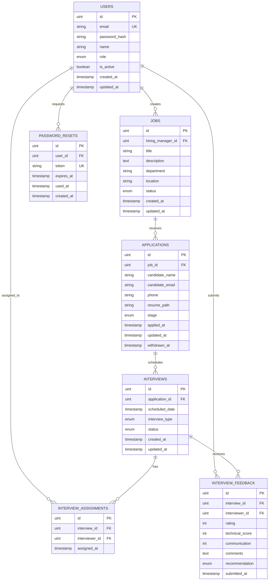

# HireFlow Database Schema

## Overview

Complete database schema for HireFlow ATS supporting all 21 user stories.

---

## Entity Relationship Diagram

---

## Tables

### 1. Users

Central table for all system users (Admin, Hiring Manager, Interviewer, Candidate).

| Field         | Type      | Constraints               | Description                                           |
| ------------- | --------- | ------------------------- | ----------------------------------------------------- |
| id            | uint      | PRIMARY KEY               | Auto-increment                                        |
| email         | string    | UNIQUE, NOT NULL, indexed | User email                                            |
| password_hash | string    | NOT NULL                  | Bcrypt hashed password                                |
| name          | string    | NOT NULL                  | User full name                                        |
| role          | enum      | NOT NULL                  | 'admin', 'hiring_manager', 'interviewer', 'candidate' |
| is_active     | boolean   | DEFAULT true              | For user deactivation                                 |
| created_at    | timestamp |                           | Account creation time                                 |
| updated_at    | timestamp |                           | Last update time                                      |

**Indexes:** email, role

---

### 2. Jobs

Job postings created by hiring managers.

| Field             | Type      | Constraints                               | Description      |
| ----------------- | --------- | ----------------------------------------- | ---------------- |
| id                | uint      | PRIMARY KEY                               | Auto-increment   |
| hiring_manager_id | uint      | FOREIGN KEY → Users.id, NOT NULL, indexed | Creator          |
| title             | string    | NOT NULL, indexed                         | Job title        |
| description       | text      | NOT NULL                                  | Job details      |
| department        | string    | indexed                                   | Department name  |
| location          | string    |                                           | Job location     |
| status            | enum      | DEFAULT 'Open'                            | 'Open', 'Closed' |
| created_at        | timestamp |                                           | Creation time    |
| updated_at        | timestamp |                                           | Last update time |

**Relationships:**

- `hiring_manager_id` → Users.id (one manager creates many jobs)

**Indexes:** hiring_manager_id, title, department, status

---

### 3. Applications

Candidate applications to specific jobs.

| Field           | Type      | Constraints                              | Description                                    |
| --------------- | --------- | ---------------------------------------- | ---------------------------------------------- |
| id              | uint      | PRIMARY KEY                              | Auto-increment                                 |
| job_id          | uint      | FOREIGN KEY → Jobs.id, NOT NULL, indexed | Applied job                                    |
| candidate_name  | string    | NOT NULL, indexed                        | Candidate name                                 |
| candidate_email | string    | NOT NULL, indexed                        | Candidate email                                |
| phone           | string    |                                          | Phone number                                   |
| resume_path     | string    |                                          | File path (storage/resumes/)                   |
| stage           | enum      | DEFAULT 'Applied'                        | 'Applied', 'Interview', 'Selected', 'Rejected' |
| applied_at      | timestamp | DEFAULT current_timestamp                | Application time                               |
| updated_at      | timestamp |                                          | Last update time                               |
| withdrawn_at    | timestamp | NULL                                     | Withdrawal time                                |

**Relationships:**

- `job_id` → Jobs.id (one job has many applications)

**Indexes:** job_id, candidate_email, stage, applied_at

---

### 4. Interviews

Scheduled interviews for applications.

| Field          | Type      | Constraints                                      | Description                                |
| -------------- | --------- | ------------------------------------------------ | ------------------------------------------ |
| id             | uint      | PRIMARY KEY                                      | Auto-increment                             |
| application_id | uint      | FOREIGN KEY → Applications.id, NOT NULL, indexed | Related application                        |
| scheduled_date | timestamp | NULL                                             | Interview date/time                        |
| interview_type | enum      |                                                  | 'Phone', 'Video', 'In-Person', 'Technical' |
| status         | enum      | DEFAULT 'Scheduled'                              | 'Scheduled', 'Completed', 'Cancelled'      |
| created_at     | timestamp |                                                  | Creation time                              |
| updated_at     | timestamp |                                                  | Last update time                           |

**Relationships:**

- `application_id` → Applications.id (one application can have multiple rounds)

**Indexes:** application_id, scheduled_date, status

---

### 5. InterviewAssignments

Maps interviewers to interviews (many-to-many).

| Field          | Type      | Constraints                                    | Description          |
| -------------- | --------- | ---------------------------------------------- | -------------------- |
| id             | uint      | PRIMARY KEY                                    | Auto-increment       |
| interview_id   | uint      | FOREIGN KEY → Interviews.id, NOT NULL, indexed | Related interview    |
| interviewer_id | uint      | FOREIGN KEY → Users.id, NOT NULL, indexed      | Assigned interviewer |
| assigned_at    | timestamp | DEFAULT current_timestamp                      | Assignment time      |

**Relationships:**

- `interview_id` → Interviews.id
- `interviewer_id` → Users.id (role='interviewer')

**Indexes:** interview_id, interviewer_id

---

### 6. InterviewFeedback

Structured feedback from interviewers.

| Field           | Type      | Constraints                                    | Description                                        |
| --------------- | --------- | ---------------------------------------------- | -------------------------------------------------- |
| id              | uint      | PRIMARY KEY                                    | Auto-increment                                     |
| interview_id    | uint      | FOREIGN KEY → Interviews.id, NOT NULL, indexed | Related interview                                  |
| interviewer_id  | uint      | FOREIGN KEY → Users.id, NOT NULL, indexed      | Feedback author                                    |
| rating          | int       |                                                | Overall rating (1-5)                               |
| technical_score | int       |                                                | Technical skills (1-5)                             |
| communication   | int       |                                                | Communication skills (1-5)                         |
| comments        | text      |                                                | Detailed feedback                                  |
| recommendation  | enum      |                                                | 'Strong Hire', 'Hire', 'No Hire', 'Strong No Hire' |
| submitted_at    | timestamp | DEFAULT current_timestamp                      | Submission time                                    |

**Relationships:**

- `interview_id` → Interviews.id
- `interviewer_id` → Users.id

**Indexes:** interview_id, interviewer_id

---

### 7. PasswordResets

Temporary tokens for password reset flow.

| Field      | Type      | Constraints                               | Description           |
| ---------- | --------- | ----------------------------------------- | --------------------- |
| id         | uint      | PRIMARY KEY                               | Auto-increment        |
| user_id    | uint      | FOREIGN KEY → Users.id, NOT NULL, indexed | User requesting reset |
| token      | string    | UNIQUE, NOT NULL, indexed                 | Reset token (UUID)    |
| expires_at | timestamp | NOT NULL                                  | Token expiration      |
| used_at    | timestamp | NULL                                      | When token was used   |
| created_at | timestamp |                                           | Creation time         |

**Relationships:**

- `user_id` → Users.id

**Indexes:** user_id, token, expires_at

**Security:** Tokens expire after 1 hour, single-use only.

---

## Key Design Decisions

### 1. Single Users Table with Role Enum

- Simplifies authentication
- Easy role-based access control
- Can extend with permissions table later

### 2. Applications Instead of Candidates Table

- Same person can apply to multiple jobs
- Application-specific data (stage, resume) tied to specific job
- Better data integrity

### 3. Separate Interviews + InterviewAssignments

- Supports multiple interview rounds per application
- Supports panel interviews (multiple interviewers)

### 4. Stage Tracking at Application Level

- Clear hiring workflow: Applied → Interview → Selected/Rejected
- Easy filtering for hiring managers

---

## Migration Strategy

**Sprint 1:** Users, Jobs, Applications (basic flow)  
**Sprint 2:** Interviews, InterviewAssignments, InterviewFeedback, PasswordResets (authentication + feedback)  
**Sprint 3+:** Audit logs, notifications, advanced features

---

## Indexing Strategy

**High-traffic queries:**

- Find jobs by hiring manager: `hiring_manager_id`
- Search applications by email/name: `candidate_email`, `candidate_name`
- Filter applications by stage: `stage`
- Find interviews for application: `application_id`
- Find assigned interviews for interviewer: `interviewer_id`

---

## Future Extensibility

**Easy additions (non-breaking):**

- Notifications table
- AuditLogs table
- Comments table
- Documents table (multiple resume versions)
- InterviewScheduleRequests table
